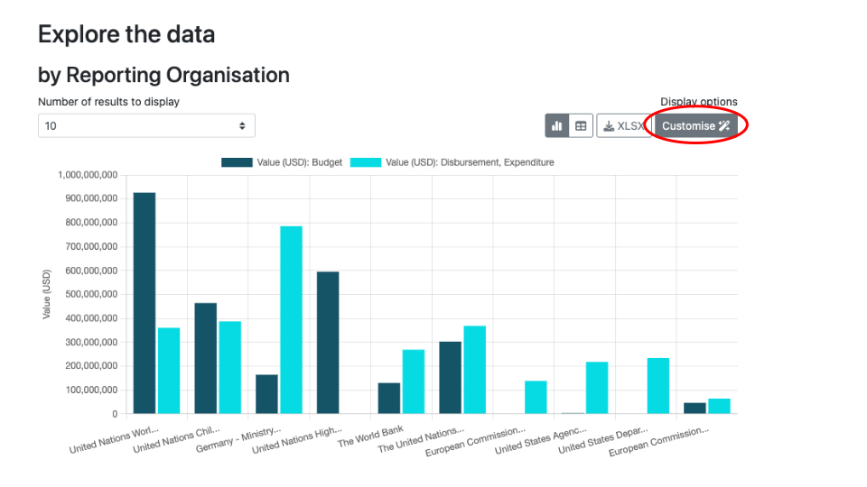
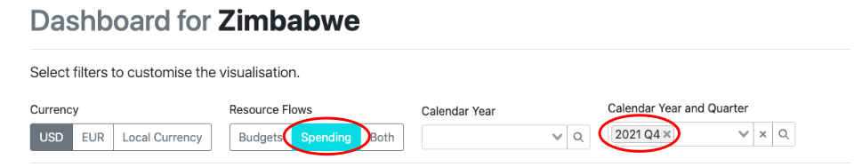

****************
Example Queries
****************

1. :ref:`How do I find organisations involved in humanitarian responses? <q1>`
2. :ref:`What external resources were spent in 2021 Q4 in Zimbabwe? <q2>`

| 

---------

| 

.. _q1: 
1: How do I find organisations involved in humanitarian responses?
-------------------------------------------------------------------

A Local NGO is looking to coordinate with other organisations. They want to find a list of organisations who are supporting the humanitarian response in Lebanon.

Using CDFD, they access the recipient country/region `Summary Dashboard for Lebanon <https://countrydata.iatistandard.org/data/recipient-country-or-region/LB/?filters=transaction_type%3A3,4,budget%3Byear%3A2024>`_. 
The Dashboard includes an overview of budgets and spend by :iati-reference:`reporting-org`. These are the different organisations that have published IATI data.

    CDFD Lebanon Dashboard: Explore the data by Reporting Organisation

Using the “Customise” button allows them to create a custom data download from the reporting organisation graph. 

They select the following options:

* View the Dashboard as a table
* Add :iati-reference:`provider-org` and :iati-reference:`receiver-org` using the columns drop down menu. These are the organisations listed as providing or receiving funding as part of the activity.
* Add a humanitarian filter using the “More Filters” menu

The `resulting table <https://countrydata.iatistandard.org/data/custom/?drilldowns=reporting_organisation_type%3Bprovider_organisation%3Breceiver_organisation&filters=humanitarian%3A1%3Brecipient_country_or_region%3ALB%3Btransaction_type%3A3,4,budget%3Byear%3A2024&displayAs=table>`_ can be downloaded in XLSX format for further analysis.

.. note::
    If :iati-reference:`provider-org` or :iati-reference:`receiver-org` are not specified for individual transactions, 
    CDFD will populate these fields using the reporting and participating organisations elements. 
    See the Methodology section on :ref:`Provider and receiver organisations` for more information.

| 

.. _q2: 
2: What external resources were spent in 2021 Q4 in Zimbabwe?
-------------------------------------------------------------------

The Ministry of Finance in Zimbabwe needs data on external inflows to the country to feed into the quarterly calculation of Balance of Payments. 
They want to find out about external resources spent in 2021 Q4 in Zimbabwe.

Using CDFD, they access the recipient country/region `Summary Dashboard for Zimbabwe <https://countrydata.iatistandard.org/data/recipient-country-or-region/ZW/?filters=calendar_year_and_quarter%3A2021%20Q4%3Btransaction_type%3A3,4>`_, 
and filter to the 2021 Q4 period. They also select the “Spending” resource flows option to focus on disbursements and expenditures. 

    CDFD Zimbabwe Dashboard: Filters

They can then download tables of spend disaggregated by sector or reporting organisation, or customise the output further as needed. 
