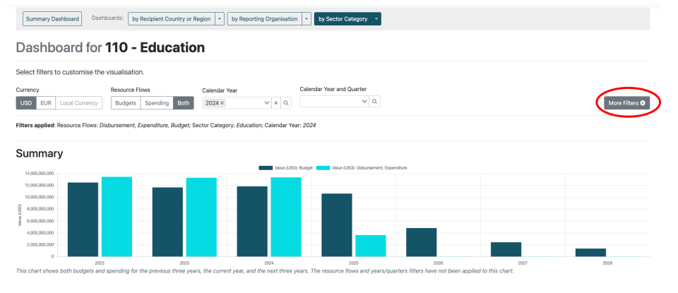
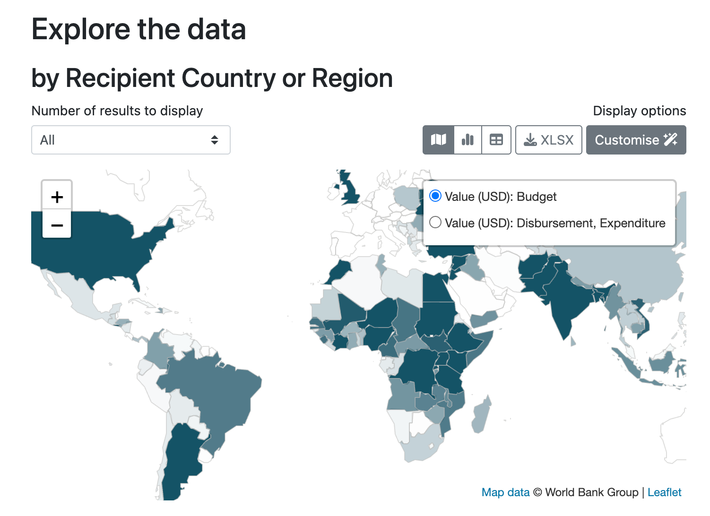
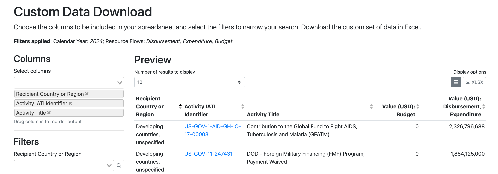
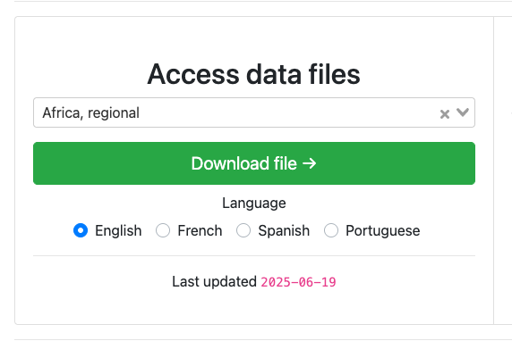

************************
Getting started
************************

Data published to the `IATI standard <https://iatistandard.org/en/iati-standard/203/>`_ can be complex, containing transactions, documents, results, and more.
CDFD processes and outputs a subset of the data, with a focus on data most relevant to partner country governments.

Accessing the data
==================

CDFD provides three ways to access the processed IATI data:

`Data Dashboards <https://countrydata.iatistandard.org/data/?filters=transaction_type%3A3,4,budget%3Byear%3A2024>`_
------------------------------------------------------------------------------------------------------------------------

CDFD Data Dashboards provide interactive, visual summaries of budgets and spend by recipient count/region, reporting organsation, or DAC 3 digit sector categories.
Various filters can be applied to customise the dashboards, with the full menu of filters available from the "More Filters" button.

    CDFD Data Dashboard for the "110 - Education" Sector Category

Individual figures on the dashboard can be viewed as maps, graphs, or tables. The data used to create each figure can be downloaded in spreadsheet (XLSX) format.

    Recipient Country or Region map from the "110 - Education" Sector Category Data Dashboard

`Custom Data Download <https://countrydata.iatistandard.org/data/custom/?drilldowns=recipient_country_or_region%3Bactivity.iati_identifier%3Bactivity.title&filters=transaction_type%3A3,4,budget%3Byear%3A2024&displayAs=table>`_
------------------------------------------------------------------------------------------------------------------------------------------------------------------------------------------------------------------------------------

CDFD Custom Data Download allows you to download a custom set of data in spreadsheet format. 
The included columns, filters and currency can all be customised.

    Finance Type graph from the "110 - Education" Sector Category Data Dashboard

`Country/Region Data Files <https://countrydata.iatistandard.org/>`_
--------------------------------------------------------------------------

The full processed data set for each Recipient Country/Region can be downloaded from the CDFD homepage. 
Each file is downloadable in English, French, Spanish, or Portuguese (where available), in spreadsheet format.

    CDFD Country/Region Data Files download widget.
